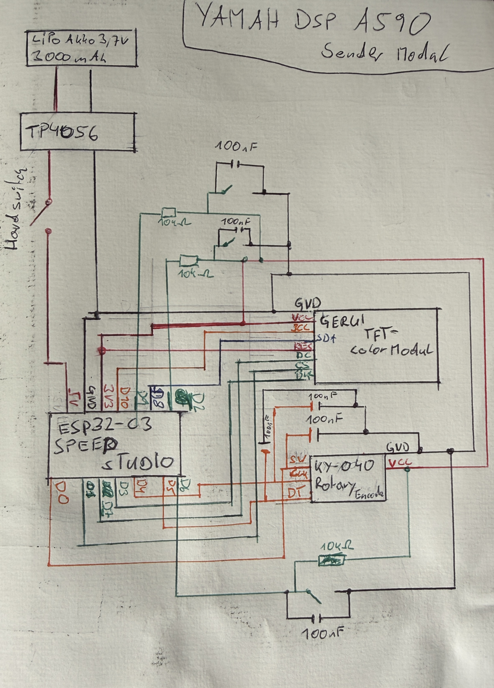
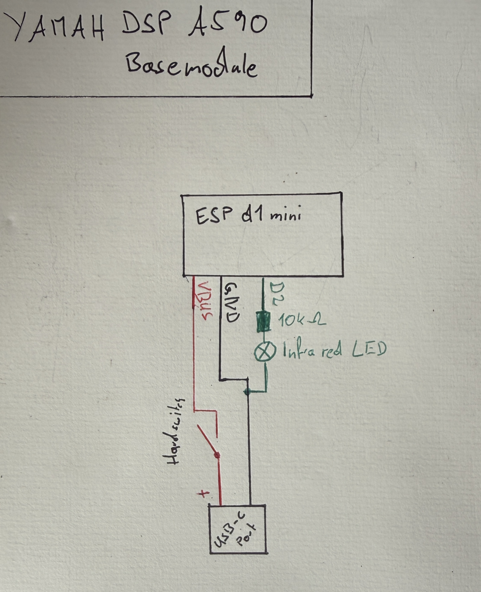

# DIY-Remote YAMAHA DSP-A590

This README.md file and some of the code were written with the help of AI. Be graceful to me, this is my first C++ and Arduino project.


A custom, self-developed remote control system for the YAMAHA DSP-A590 amplifier. This project replaces or augments the original infrared remote by using ESP32 microcontrollers to establish a reliable, low-latency communication link via the ESP-NOW protocol.

## Table of Contents

- [Features](#features)
- [Hardware Requirements](#hardware-requirements)
- [Schematics & Wiring](#schematics--wiries)
- [Getting Started](#getting-started)
- [My 3D-Modles](My-3D-Modlesnotes)

## Features

- **ESP-NOW Communication:** Fast, router-independent peer-to-peer protocol with automatic WiFi channel synchronization.
- **Power Management:** The remote enters deep sleep after a 20-second timeout. It wakes up via a GPIO hardware interrupt to maximize battery life.
- **Menu UI:** Visual feedback for volume, input channels, DSP effects, and speaker delays via an ST7789 color display.
- **Custom 3D Enclosure:** Printable case. (The Case is not quite right for all parts to go in.)

## Hardware Requirements

### Transmitter Module (Remote)

- [ ] 1x Seeed Studio XIAO ESP32-C3
- [ ] 1x ST7789 TFT Color Display (SPI)
- [ ] 1x KY-040 Rotary Encoder
- [ ] 3x Push Buttons (Menu UP, Menu DOWN, Power)
- [ ] 1x TP4056 LiPo Charging Module
- [ ] 1x 3.7V 3000mAh LiPo Battery
- [ ] 3x 10kΩ Resistors & 6x 100nF Capacitors
- [ ] Custom 3D-printed enclosure

### Receiver Module (Base Station)

- [ ] 1x ESP32 (Base Station Controller)
- [ ] 1x USB-C port
- [ ] 1x Infrared LED
- [ ] 1x suitable resister for LED ## Schematics & Wiring

### Transmitter Module (Remote)


_Fig 1: Schematic for the remote control module including hardware debouncing._

### Receiver Module (Base Station)


\_Fig 2: Schematic for the base station connected to the YAMAHA DSP-A590.`)

## Getting Started

1. **Clone the repository:**
   ```bash
   git clone [https://github.com/yourusername/DIY-Remote-YAMAHA-DSP-A590.git](https://github.com/yourusername/DIY-Remote-YAMAHA-DSP-A590.git)
   ```

## Hardware Requirements

## 3D Printed Enclosure

The custom enclosure was designed in Blender. It features a 5mm wall thickness and precise cutouts for the TFT screen and the USB-C charging port.

You can view and download the STL files directly from this repository:

- [📦 Download Base Case](3d-modles/remotecontroll-basismodul-case.stl)
- [📦 Download Base Lid](3d-modles/remotecontroll-basismodul-case-lid.stl)
- [📦 Download Remote Case](3d-modles/RemoteControll-case.stl)
- [📦 Download Remote Lid](3d-modles/RemoteControll-case-lid.stl)
